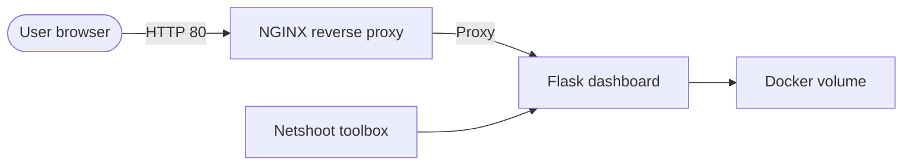

# Docker Network Operations Lab

This project demonstrates how system and network engineers can build a simple yet realistic **Docker‑based lab**.  The lab deploys a small web application behind a reverse proxy and includes a toolbox container for network troubleshooting.  By containerising the services you get **consistent environments** across development, testing and production, and you can spin up or tear down infrastructure quickly

## Overview

The repository contains three cooperating services defined in a [`docker-compose.yml`](docker-compose.yml) file:

| Service         | Role in the lab                       |
|---------------|---------------------------------------|
| **NGINX reverse proxy** | Receives HTTP requests on port 80 and forwards them to the Flask application.  It demonstrates how a proxy can decouple user traffic from backend services. |
| **Flask dashboard** | A minimal Python web application.  The code lives in the [`app/`](./app/) directory.  This container mounts a persistent volume so that state can survive container restarts. |
| **Netshoot toolbox** | A container based on the [netshoot image](https://github.com/nicolaka/netshoot) loaded with tools like `ping`, `curl` and `tcpdump`.  It helps engineers debug network connectivity within the Docker network. |

The services share a custom Docker network (`ops_net`), which allows them to resolve each other by service name.  Docker automatically creates the necessary Linux bridges, sets up IP addresses and provides service discovery when containers join the same network.

## Architecture diagram

Below is a **Mermaid** diagram that illustrates the topology.  The `User` sends HTTP traffic to the NGINX reverse proxy.  NGINX proxies requests to the Flask application, which stores data on a Docker volume.  A separate Netshoot container connects to the same network for debugging.



### Conceptual image

To give a visual sense of what a system & network engineer does when containerising services, the repository includes a conceptual illustration of an engineer working with Docker containers:


## Running the lab

1. **Clone the repository** and change into the project directory:
   ```bash
   git clone <your-fork-url>
   cd docker-network-lab
   ```

2. **Build and start the services** using Docker Compose:
   ```bash
   docker compose up -d --build
   ```
   Docker will build the Flask application image, pull the required images for NGINX and Netshoot and create a custom bridge network.  Once the containers are running you can list them with `docker ps`.

3. **Verify the dashboard**.  Open a browser and navigate to `http://localhost`.  You should see the dashboard message served via the NGINX reverse proxy.

4. **Explore the network**.  To troubleshoot connectivity, open a shell inside the toolbox container:
   ```bash
   docker exec -it network_tools sh
   ```
   Once inside, try pinging the Flask service by its service name (`app`) and curling the HTTP endpoint:
   ```sh
   ping -c 3 app
   curl http://app:5000
   ```
   Because the containers share the same network, service discovery works out of the box【588612204273761†L123-L140】.

5. **Stop the lab** when finished:
   ```bash
   docker compose down
   ```

## Why system engineers use Docker

Docker brings several benefits that appeal to system and network engineers:

- **Environment consistency** – Containers encapsulate the application, its libraries and dependencies so that it runs the same way on every host【328800923888573†L213-L221】.  This reduces the “works on my machine” problem and makes collaboration smoother.
- **Faster deployment and scaling** – Containers are lightweight and can be started or stopped quickly.  Packaging applications in containers allows you to spin resources up or down without the overhead of a full OS, which leads to faster deployments and fewer outages【345673926201081†L285-L294】.
- **Service isolation** – Each container runs in its own isolated environment.  If one service crashes or is compromised, it doesn’t take down the others.  Isolation also makes it easier to roll out updates without disrupting the rest of the system【345673926201081†L285-L294】.
- **Portability and platform independence** – Containers can run on any host with Docker installed, whether that’s your laptop, a staging server or a production cluster.  This portability makes migrations and multi‑cloud strategies easier.
- **Built‑in service discovery** – Docker’s networking drivers provide DNS‑based service discovery within a network.  Containers on the same network can reach each other by name without manual IP configuration【588612204273761†L123-L140】.

By combining these benefits, engineers can automate infrastructure, shorten feedback loops and build more robust systems.

## Next steps

This lab is intentionally simple.  You can extend it by:

* Adding authentication and metrics to the Flask dashboard.
* Integrating [Traefik](https://traefik.io/) or another reverse proxy with SSL termination.
* Switching the network driver to `overlay` and deploying the stack across multiple hosts using Docker Swarm.  The overlay driver provides multi‑host connectivity and DNS-based service discovery across a cluster【588612204273761†L164-L186】.
* Introducing a database container (such as PostgreSQL) and testing persistent volumes.

Feel free to fork the repository and make it your own.

---

### Footnotes

1. Docker’s bridge network driver creates a private network for containers on the same host and provides service discovery【588612204273761†L123-L140】【588612204273761†L153-L156】.
2. Docker containers encapsulate code, libraries and dependencies so applications run consistently across different environments【328800923888573†L213-L221】.
3. Containers enable faster deployments and isolated updates because they are lightweight and self‑contained【345673926201081†L285-L294】.
